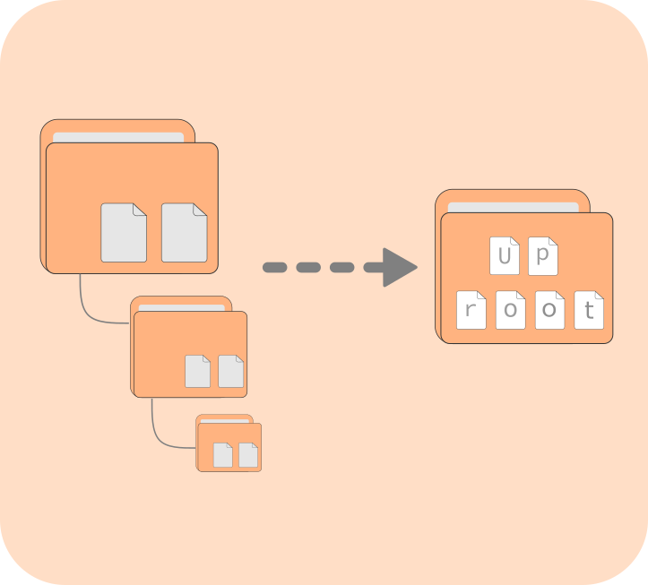

<h1 align="center">UPROOT</h1>
<p align="center">
    
</p>

<h2 align="center">Bring deeply nested files or folders to the surface</h2>

<p align="center">
  
</p>

Uproot helps convert a directory structure like this:
```
.
└── tv_series_season_1
    ├── tv_series_season_1_episode1
    │   ├── tv_series_season_1_episode1.mkv
    │   └── tv_series_season_1_episode1.srt
    ├── tv_series_season_1_episode2
    │   ├── tv_series_season_1_episode2.mkv
    │   └── tv_series_season_1_episode2.srt
    ├── tv_series_season_1_episode3
    │   ├── tv_series_season_1_episode3.mkv
    │   └── tv_series_season_1_episode3.srt
    ├── tv_series_season_1_episode4
    │   ├── tv_series_season_1_episode4.mkv
    │   └── tv_series_season_1_episode4.srt
    └── tv_series_season_1_episode5
        ├── tv_series_season_1_episode5.mkv
        └── tv_series_season_1_episode5.srt
```

 to this:
 ```
 tv_series_season_1
├── tv_series_season_1_episode1.mkv
├── tv_series_season_1_episode1.srt
├── tv_series_season_1_episode2.mkv
├── tv_series_season_1_episode2.srt
├── tv_series_season_1_episode3.mkv
├── tv_series_season_1_episode3.srt
├── tv_series_season_1_episode4.mkv
├── tv_series_season_1_episode4.srt
├── tv_series_season_1_episode5.mkv
└── tv_series_season_1_episode5.srt
```

## Installation
There are several ways of installing the script, but currently I have only tested on Linux.
### Windows and Mac OS
If you are on Windows or Mac OS, you will need to first install python. Once you have python installed  
you can download the zip file and extract it to your preferred location.

### Linux
On Arch Linux, you can install Uproot through the AUR:
```bash
yay -S uproot-git
```
Other Linux distro users can run the following command:
```bash
sudo -fLo /usr/bin/uproot --create-dirs \
https://raw.githubusercontent.com/keystroke3/uproot/main/uproot.py &&
sudo chmod +x /usr/bin/uproot
```

## Usage
**NOTE: There is currently no way of reversing the actions of uproot. Use with caution.**  

If you are on Linux, you can quickly use uproot from anywhere in your terminal by running:
```bash
uproot <source_foulder>
```
If you are on Windows or Mac OS, the same can be achieved by running
```bash
python uproot.py <source_folder>
```
in the directory where you unzipped your files.  
For example:
```bash
uproot tv_series_season_1
```
will have the same results as shown above.  If we are already in the desired folder, we can replace the folder name with a dot (`.`) 

All the other options can be shown by running 
```
uproot -h
```
The out put will be something like this:
```bash
usage: uproot [-h] [-s SOURCE] [-o OUTPUT] [-O MAKE_OUTPUT] [-r] [-R] [-c] [-v] [-d]

This is a simple program for recursively moving files from subdirectories to the current or specified directory

options:
  -h, --help            show this help message and exit
  -s SOURCE, --source SOURCE
                        The folder to perform moving operations on. Defaults to the current directory not specified
  -o OUTPUT, --output OUTPUT
                        The folder to move files to. Defaults to the root of the starting directory or current directory. This has to be outside the source directory
  -O MAKE_OUTPUT, --make_output MAKE_OUTPUT
                        Same as --output but creates the output directory if specified one does not exist.
  -r, --remove_empty    Specifies if the empty directories should be cleared after moving. Defaults to false if this flag is not set.
  -R, --remove_empty_source
                        same as --remove_empty but also removes the source directory itself.
  -c, --copy            Copy files to destination instead of moving
  -v, --verbose         Prints the current operations.
  -d, --directories     Operates on the directories at the bottom of the file tree instead of files
  ```

These options can be chained together for example:
```bash
uproot -s tv_series_season_1 -vRO ../tv_series_season_1_with_subs
```
This command will result in the following series of operations:
-  the files in `tv_series_season_1` and uproot them to a directory `tv_series_season_1_with_subs` in the parent directory relative to the current one.
- If the output directory doesn't exist, it will create it, because of `-O` instead of `-o` flag.
- After that, it will remove all the empty directories in `tv_series_season_1` and if the source directory is left empty, it will removed it as well, because of `-R` instead of `-r` flag.

## Contribution
This is a hobby project, so bugs can be expected. If you encounter any bugs, feel free to create an issue and make sure to leave as much detail as possible to come up with a solution.  
If you own a Windows or Mac OS machine, you could create executables and installation instructions for those platforms. If you do, please create a pull request.  
A GUI will also be nice so people don't have to use a terminal for to run the script.  
Do you have any more things you can add to the program, fork it, fix it add it and create a pull request.

### Donation
If you like the project and would like to support me for some reason: [PayPal me](https://paypal.com/keystroke33@gmail.com)